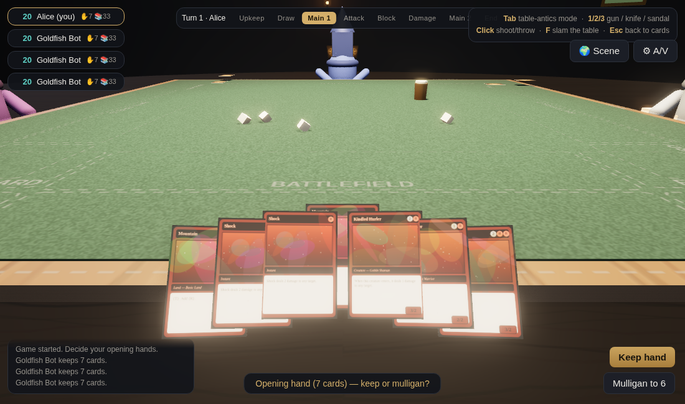
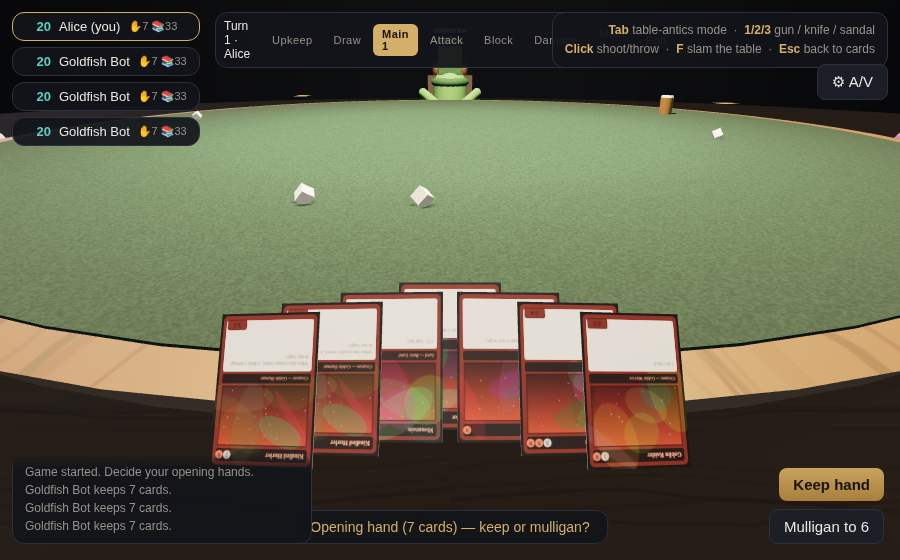
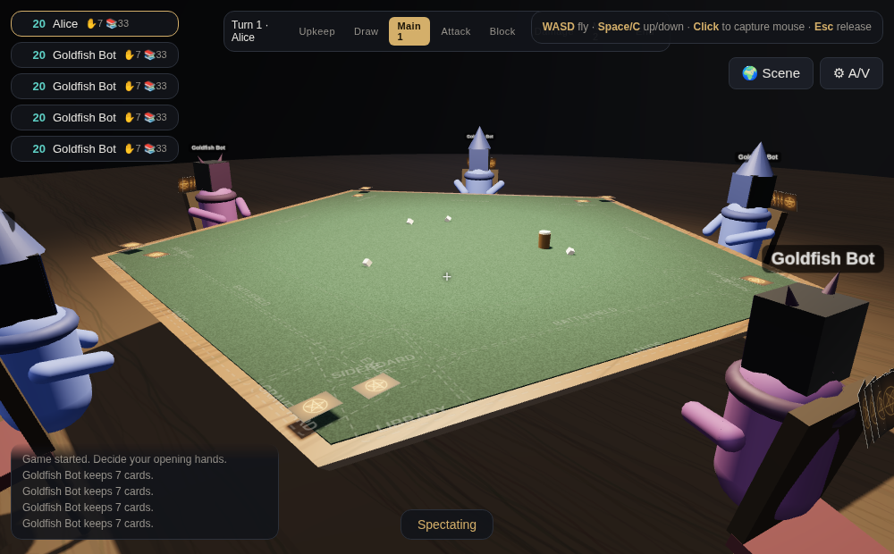
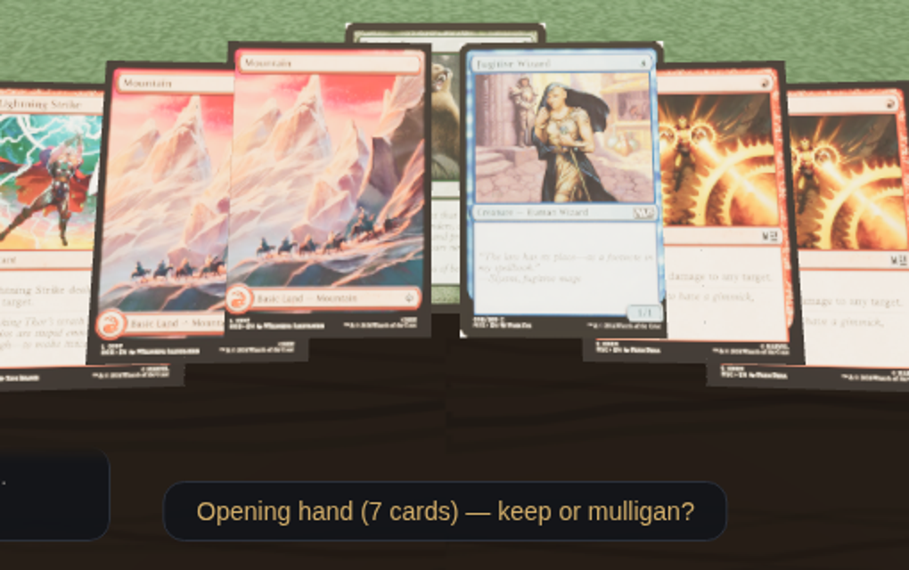
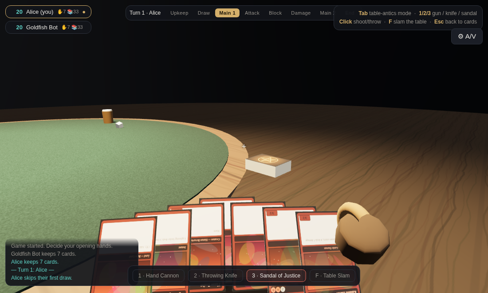
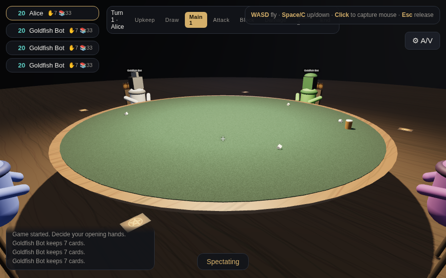
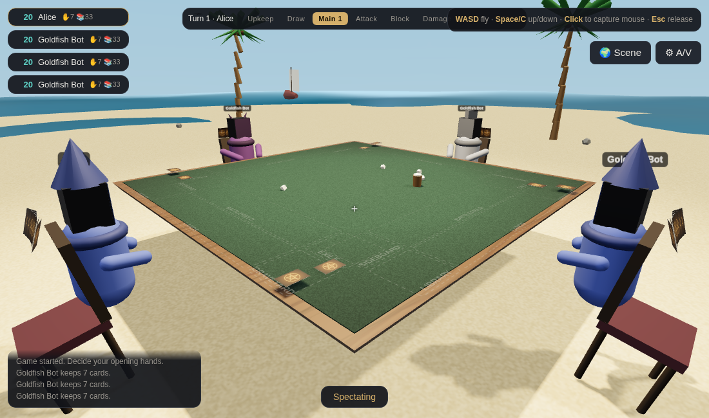
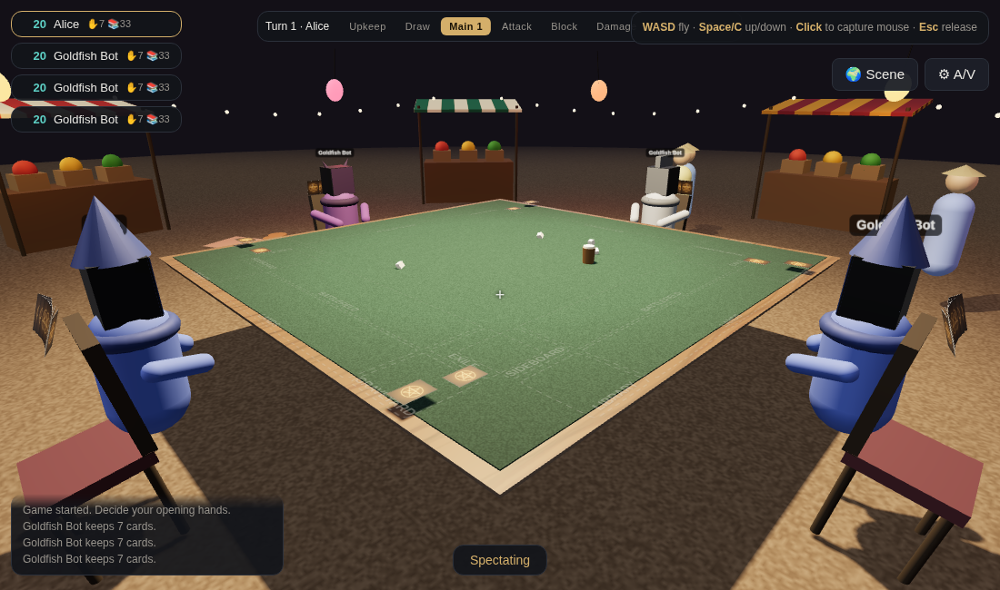

# Planar Table — a 3D browser tabletop for Magic: The Gathering

A Tabletop Simulator-style 3D multiplayer game in the browser, specialized for
Magic: The Gathering. Players sit at fixed first-person seats around a table
that scales with the player count, play real games of Magic through a
server-authoritative rules engine, see each other's webcam feeds on their
avatars' faces — and, when diplomacy fails, switch to a secondary FPS mode to
shoot, throw knives, hurl sandals, and slam the table.




## Quick start

```bash
cd mtg-tabletop
npm install
npm start          # builds the client and serves at http://localhost:8080
# or, during development:
npm run dev        # same server with Vite middleware (no build step, hot reload)
```

Open `http://localhost:8080`, **Host game** (2–6 seats), share the 4-letter
room code; friends **Join as player** or **Join as spectator**. The host can
also **Add practice bot** to try things solo.

The table is a **square for 2–4 players** and becomes an **n-sided polygon
with one flat side per player** for 5+ (pentagon for five, hexagon for six),
sized to the player count:



`npm test` runs the rules-engine smoke test. `npm run test:visual` drives the
whole game in headless Chrome and writes screenshots to `screens/`
(requires `npm i --no-save puppeteer` first, and the server running).

## How it plays

### Primary mode — playing Magic (the cards come first)
Your view is locked to your seat in first person; the cursor gently steers the
camera. Click cards in your hand fan to play lands or cast spells, click your
lands to tap them for mana (an Arena-style auto-tapper also pays costs
automatically), click creatures to declare attackers/blockers, click avatars or
life chips to choose targets and defenders.

The rules engine is server-authoritative and implements the core of Magic the
way MTG Arena does:

- Zones: library, hand, battlefield, graveyard, exile, and **the stack**
- London-style opening hands with mulligans, hidden information properly
  redacted per player (opponents and spectators never receive your hand)
- Full turn structure: untap → upkeep → draw → main 1 → combat
  (begin/attackers/blockers/damage/end) → main 2 → end → cleanup with
  discard-to-7
- Priority passing with Arena-style auto-yield (stops at your main phases,
  combat declarations, and whenever an opponent's spell is on the stack;
  a **Full control** toggle disables all auto-passing)
- Casting at sorcery/instant speed, counterspells, targeting validation,
  one-land-per-turn, mana pools that empty between steps
- Combat with summoning sickness, haste, flying/reach, vigilance, trample,
  deathtouch, lifelink, can't-block, multi-blocker damage assignment
- State-based actions: lethal damage, zero toughness, life loss, decking
- Multiplayer free-for-all (2–6 players): pick the defending player each combat
- ETB triggers, life gain/drain, card draw, pumps, destruction, exile
- Win/loss, concession, and spectator-safe views

Cards animate physically — drawn from the deck stack with an arc, cast onto a
floating stack spiral above the table, tap by rotating sideways, die by
sinking away — generic but lively motion on every game action.

**Zones.** Every seat gets a printed playmat with explicit zones — battlefield
and lands rows, library, graveyard, exile, and sideboard pads — plus the hand
fan floating in front of you. Hidden zones stay hidden: opponents see only
your hand/library/sideboard counts.

### Decks: built-in starter cube or Scryfall import

The included set is a self-contained starter cube (5 colors, ~30 cards) with
five prebuilt 40-card decks (each with a small sideboard) that work fully
offline.

For real cards, pick **“Custom deck — paste a list or URL…”** in the deck
dropdown on the start page (or use the import box in the room) and paste
either:

- a **decklist** — `4 Lightning Strike` per line, optional `Sideboard`
  section, or
- a **deck URL** — Moxfield, Archidekt, MTGGoldfish, TappedOut, or any link
  that serves a plain-text list. The server fetches the list from the deck
  site for you.

The deck is validated and imported automatically when you host or join. Card
data is fetched **on demand from Scryfall** — batched through
`/cards/collection`, converted to the engine's format, and cached in memory
and on disk, so the full card database is never stored. Card scans are
proxied through the game server (Scryfall's CDN has no CORS headers) and
rendered onto the 3D cards:



Import coverage follows the engine: any creature (cost, P/T, supported
keywords), single-color tap lands incl. basics, and instants/sorceries whose
oracle text matches a supported effect (burn, draw, destroy, exile, counter,
pumps, drain, lifegain). Unsupported cards are reported by name instead of
silently misbehaving.

### Secondary mode — table antics (press **Tab**)



Pointer-locked FPS view from your seat (you still can't leave your chair —
just like Tabletop Simulator, the table is your world):

- **1** Hand Cannon (hitscan, tracer, muzzle flash, recoil)
- **2** Throwing Knife (spinning projectile with gravity)
- **3** Sandal of Justice (the classic chancla, arcs beautifully)
- **F** Table slam — shockwave ring, screen shake, the dice and beer mug jump…
  **but cards on the table are explicitly excluded from the physics** — the
  game state is sacred
- Hits bonk opponents' avatars (comedic head knockback + sound); getting shot
  flashes your screen
- All effects are broadcast to everyone at the table and are purely cosmetic —
  they can never alter the game

Press **Esc** or **Tab** to go back to your cards.

### Spectators
Join any room as a spectator: free-fly FPS movement (**WASD + Space/C**, click
to capture the mouse) around the room. Spectators see the full table but no
hidden hands.



### Environments (🌍 Scene)
Any player can change the scene around the table; the choice syncs to
everyone. Environment events are strictly audiovisual — they never move the
table, its props, or any card. All ambience is synthesized WebAudio (no sound
files):

- **Tavern** — the default dark den.
- **Living Room** — full living-room set (sofa, rug, bookshelf, floor lamp);
  the TV switches itself on for exactly 3 seconds — picture, glow, and a
  jaunty jingle — at random intervals of no less than 5 minutes.
- **Beachside** — sand, ocean, palms; **sun glare** when you look up toward
  the sun, 3D birds flying through with proximity-based chirps, a constant
  wave bed, and a **tidal wave every 5 minutes** that sweeps the beach and
  dissolves before reaching the table.
- **Asian Marketplace** — stalls, lanterns and a constant crowd-chatter bed;
  passerby NPCs walk behind the players from random directions, each with
  their own chitchat that gets louder the closer they pass.
- **Mountain Peak** — summit plateau ringed by snowy peaks and drifting
  clouds; passing birds (proximity audio), an echoing **yodel** and an
  unlucky hiker **falling off the edge with cracking-ground sounds**, each at
  random intervals of no less than 5 minutes.
- **Jungle** — dense canopy, rustling-leaves bed, and a **T-rex roar at
  varying distance** (closer = louder and brighter) at random ≥5-minute
  intervals.




For testing, set `window.__envFast = true` in the console before joining to
compress the long event timers from minutes to seconds.

### Avatars, camera & voice
- Pick one of four avatar presets in the lobby (Mage / Knight / Druid / Warlock)
- Each avatar's face is a screen: when a player enables their camera, their
  **live webcam feed renders on their avatar's face** (WebRTC mesh, no media
  ever passes through the game server — it only brokers signaling)
- ⚙ A/V panel: camera on/off, microphone on/off, **switch camera/microphone
  device live** (`replaceTrack`), and mute incoming audio

## Architecture

```
mtg-tabletop/
├── shared/              # used by BOTH server and client
│   ├── cards.js         #   built-in starter cards + dynamic card registry
│   └── engine.js        #   the MTG rules engine (authoritative on the server)
├── server/
│   ├── index.js         # express + ws: rooms, engine host, antics relay,
│   │                    # WebRTC signaling, bots, env sync, card-image proxy
│   ├── scryfall.js      # on-demand Scryfall import + disk cache
│   ├── engine.test.js   # rules-engine smoke test (node)
│   ├── scryfall.test.js # importer test (parsing + live API)
│   └── visual.test.js   # headless-Chrome end-to-end screenshot test
└── src/                 # three.js client
    ├── scene/           # world/table/seats, zone playmats, card meshes +
    │                    # tweens, hand fan, avatars (video faces), antics
    │                    # effects, environments + synthesized ambience
    ├── controls/        # seat rig, play/FPS/spectator modes, weapon viewmodels
    ├── net/             # ws client, WebRTC media mesh
    └── ui/              # HUD (phases, life, mana, prompts, log)
```

- The server owns the game state. Clients send `{type:'action', …}` messages;
  the engine validates them (you can't cheat from the client) and everyone
  receives a per-player **redacted view** plus animation events.
- Antics (`gun`/`throw`/`slam`) are a separate ephemeral channel that never
  touches the engine.
- Rendering aims at "max efficient but modern": ACES filmic tone mapping,
  PCF soft shadows, PMREM environment lighting, procedural PBR wood/felt
  textures and procedurally drawn card faces (zero external assets — works
  fully offline), pixel-ratio capping, and a single draw call per card.
